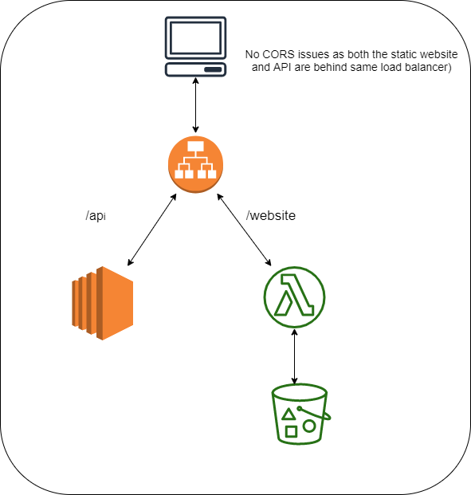

# Why Lambda as HTTP Server
This really a valid question to ask. I had a unique challenge of having a static web site connecting to a API server. However, API server is proprietary and cannot enable CORS in that server. One way I thought about this is having a Lambda based HTTP Server behind the same AWS ALB that serves API server traffic. 

# High Level Architecture where this Lambda HTTP server can be used

# Drawback 
Maximum payload size for AWS function is 256KB. So the static website that is served by this lamnda cannot have a file size > 256KB. 
